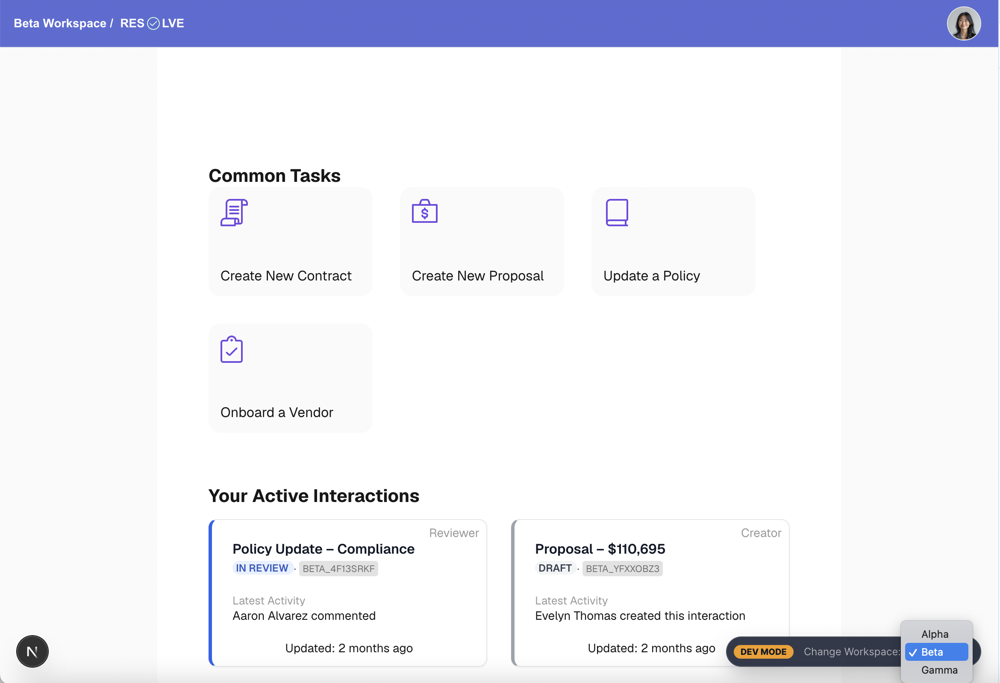

# Resolve Portal 

The Resolve Portal is a Next.js + TypeScript application built as a companion application to the main Resolve application (`@resolve/resolve-demo`), intended to simulate the customer facing piece of the ecosystem, where users can create new requests and see the current states of their own related requests.

The application models a customer dashboard experience, with pre-filtered lists of the current user's interactions, create forms for generating new interactions, as well as interaction detail page.

The portal is one application within a larger monorepo architecture. Shared domain contracts, UI components, domain services, mock persistence, and the Fastify API are maintained in separate packages and applications.



*Runtime workspace switching via Developer HUD (bottom-right) — Brand UI and network requests change to reflect different workspace.*

### What you're seeing

- The bottom-right Developer HUD is a demo-only control for changing workspace context.
- Changing workspaces updates the branding and data shown by the Portal.


## Live Demo

🔗 https://resolve-demo.vercel.app/

No authentication required.

The Developer HUD allows you to switch the workspace the portal is curently mapped to, which also forces you to select a new current user, one whom belongs to the workspace. In a production environment, workspace context could instead be established by the application's domain or other tenant-specific request context.

## What to Explore

The Resolve Portal is designed to make several of its architectural decisions
visible through the UI. Some areas worth exploring:

- **Developer HUD** — switch between workspaces to see the corresponding
  branding, users, and interaction data change.

- **Customer Dashboard** — see how the current user's interactions are
  organized into active and completed requests.

- **Create Request** — create a new interaction and observe how it appears
  in the portal and becomes available to the main Resolve application.

- **Interaction Detail** — view the details and activity history for an
  interaction created or selected within the portal.

- **Simulated Login** — select a user from the users available to the current
  workspace and see the dashboard update for that user.

- **Browser Network tab** — inspect the REST requests made by the application
  and see the workspace and user context being sent to the API.


## What It Demonstrates

- **User-specific dashboard** — interactions are displayed based on the
  currently selected user and workspace.

- **Shared network and domain behavior** — the portal uses the same API,
  domain services, workflow rules, and data model as the main Resolve
  application.

- **New request generation** — users can create new interactions, which
  generates the corresponding activity records.

- **Shared UI architecture** — reusable UI components live in `@resolve/ui`,
  while application-specific behavior is handled by Portal adapters.

- **React Hook Form with MUI** — create forms use React Hook Form together
  with Material UI components for form controls and validation.

- **Next.js App Router** — the application uses the Next.js App Router and
  its server/client component model rather than the lifecycle patterns used
  by the older Pages Router.

- **Simulated authentication** — a current user is selected from the users
  available within the active workspace rather than using a real
  authentication system.

## Architecture Overview

The Portal is intentionally a smaller application than the main Resolve
application. It owns the Next.js UI, application routing, client-side data
management, and presentation behavior, while shared domain capabilities are
provided by packages elsewhere in the monorepo.

```text
Next.js Portal
      │
      ▼
TanStack Query / Axios
      │
      ▼
@resolve/mock-api
      │
      ▼
@resolve/domain
      │
      ▼
@resolve/mock-db
```

The Portal consumes the same shared domain and API infrastructure as the main
Resolve application. This allows a request created through the Portal to become
visible to Resolve without the two applications maintaining separate
implementations of the underlying business behavior.

Shared UI components and Resolve domain contracts are also consumed from the
monorepo packages:

- `@resolve/types` — shared domain contracts
- `@resolve/ui` — shared UI components and design tokens
- `@resolve/domain` — shared domain services and business rules
- `@resolve/mock-db` — mock data and persistence
- `@resolve/mock-api` — Fastify API and request orchestration


## Tech Stack

*   Next.js 16 & TypeScript
*   TanStack Query & Axios (REST Strategy)
*   Zustand (Global Strategy State)
*   SCSS Modules
*   React Hook Form
*   Material Design (MUI) Components

    

## Running Locally

For all commands listed below, run them from the base PNPM monorepo directory.

Install dependencies:

```bash
pnpm install
```
Start the development server:

```bash
pnpm --filter portal dev
```

Open [http://localhost:3000](http://localhost:3000) with your browser to see the result.


<!-- 
## Deploy on Vercel

The easiest way to deploy your Next.js app is to use the [Vercel Platform](https://vercel.com/new?utm_medium=default-template&filter=next.js&utm_source=create-next-app&utm_campaign=create-next-app-readme) from the creators of Next.js.

Check out our [Next.js deployment documentation](https://nextjs.org/docs/app/building-your-application/deploying) for more details. 
-->
