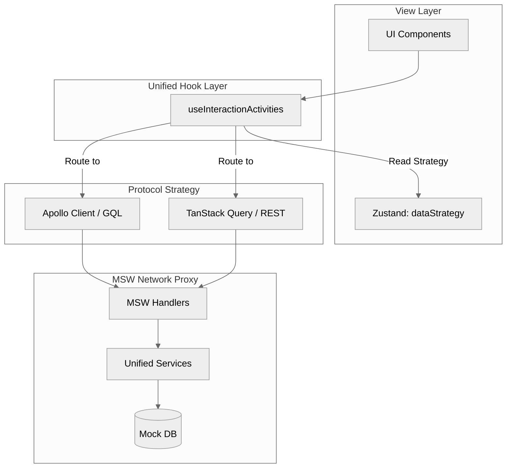
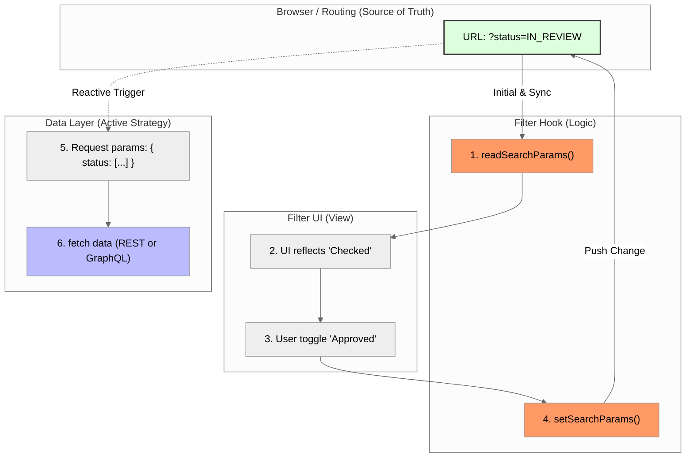
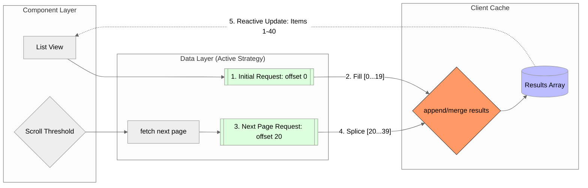

# Architecture Overview

This document describes the architectural decisions and tradeoffs behind this demo application. It assumes familiarity with React, TypeScript, GraphQL, and modern SPA patterns.

---

# Project Goals

- Demonstrate senior-level frontend architecture in a standalone, public repository  
- Model realistic enterprise-style data relationships and workflows  
- Favor clarity, maintainability, and correctness over over-abstraction  
- Support deep linking, URL-driven state, and realistic navigation flows  
- Provide a demo that can be confidently walked through in interviews  

## Non-Goals

- Building a production-grade backend  
- Pixel-perfect visual design  
- Exhaustive feature completeness  

---

# High-Level Architecture

This application is a client-side React SPA designed to be **backend-agnostic**.

At runtime, the app can switch between:
- GraphQL (Apollo Client + normalized cache)
- REST (TanStack Query + document cache)

This is controlled through a Developer HUD that allows the data strategy to be toggled at runtime.

The key idea is simple:

> The UI does not care where data comes from or how it is cached.

All data access flows through shared hooks and a unified service layer, keeping components clean and predictable.

Core principles:

- Treat server state as external and authoritative  
- Keep data access behind stable abstractions (hooks)  
- Use the URL as the source of truth for view state  
- Avoid global state unless there is a clear need  
- Keep behavior consistent regardless of protocol  

---

# Core Domain Model

The application models a small set of domain concepts:

- **Interaction** — Represents a workflow item (e.g., contract, review, approval flow)  
- **Identity** — Represents a person or company  
- **InteractionActivity** — Represents lifecycle events tied to an interaction  
- **SearchResult** — A union type that allows search across multiple entity types  

Interactions reference identities through structured parties and reviewer relationships, modeling how individuals and organizations participate in a workflow.

Activities also reference identities as actors and decision-makers, creating a connected lifecycle history across entities.

The goal is not to simulate every possible business rule, but to model realistic relationships between entities and maintain consistency across views.

---

# Data Layer & Protocol Strategy

The application uses a **protocol-agnostic data layer**.

It supports two interchangeable strategies:

- **Apollo Client (GraphQL)**  
  Uses a normalized cache with typePolicies for pagination, RBAC, and field behavior.

- **TanStack Query + Axios (REST)**  
  Uses a document-based cache with explicit query keys and manual invalidation.

## The Goal

Both strategies return the same *domain-shaped data* to the UI.

The difference is purely in:
- how data is fetched  
- how it is cached  

---

## The “Traffic Controller” Hook

Shared hooks (e.g. `useInteractionActivities`) act as the entry point for all data access.

A small Zustand store tracks the active strategy. The hook checks that value and routes the request to either:

- Apollo (GraphQL), or  
- React Query (REST)

From the component’s perspective, nothing changes.

It just asks for data and renders it.

---

## Why This Exists

This isn’t a typical production requirement, but it exists to demonstrate:

- how different data strategies behave  
- how to decouple UI from backend implementation  
- how to keep data flow predictable across approaches  

---

# Project Structure & Source of Truth

The UI never talks directly to a database or hardcoded data source.

All data flows through a shared middle layer that is agnostic to the underlying protocol.

---

## API Layer (`src/api`)

This is the core of the data system, split into three responsibilities:

- **Endpoints**  
  REST calls using TanStack Query + Axios (the “how” for REST)

- **Mocks (MSW handlers)**  
  Intercept both REST and GraphQL requests at the network level  
  Both call the same underlying services

- **Services**  
  The “brain” of the app  
  Handles filtering, sorting, pagination, and business rules

**Key idea:**  
Both REST and GraphQL resolve through the same service layer, so behavior stays consistent.

---

## GraphQL Layer (`src/graphql`)

Contains queries, mutations, and fragments used by Apollo.

This exists alongside REST endpoints rather than replacing them, allowing the app to switch between protocols without affecting the UI.

---

## Data Models (`src/types`)

Data is intentionally split into two layers:

- **API records (`api.ts`)**  
  Flat, storage-oriented data (IDs, primitives)

- **Domain entities (`schema.ts`)**  
  Hydrated, UI-ready objects with resolved relationships

The service layer is responsible for transforming records into domain entities.

---

## Why This Works

- **Consistent behavior**  
  Both protocols use the same service layer

- **Test parity**  
  Tests hit the same logic as the browser (via MSW)

- **Backend flexibility**  
  The mock layer can be replaced with a real backend without changing UI code

---

# Unified Mock Architecture (MSW)

The application uses **MSW (Mock Service Worker)** as a unified network layer.

Instead of mocking at the client level (e.g. Apollo Links), all requests are intercepted at the browser level.

This applies to both:
- GraphQL requests (Apollo)
- REST requests (Axios)

---

## Why MSW

- Requests appear in the Network tab (more realistic)
- Works the same in browser and tests
- Decouples mocking from any specific client (Apollo, Axios, etc.)

---

## Service-First Execution

All business logic lives in shared service files (e.g. `interactionService.ts`).

MSW handlers simply:

1. Receive the request  
2. Call the appropriate service  
3. Return the result  

Both REST and GraphQL handlers call the same service functions.

This guarantees identical behavior regardless of protocol.

---

## Data Flow
`UI → Hook → Apollo / React Query → MSW → Service Layer → Mock DB`

---

## Local Persistence

The mock database is synced to `localStorage`.

This allows:

- state to persist across reloads  
- consistent data between protocols  
- deterministic test setup  

---

# Testing & Environment Reality

One of the biggest strengths of this setup is that the Browser and the Test Suite are identical.

- **MSW Everywhere:** We don't "fake" internal functions. In the browser, MSW intercepts network traffic for the demo. In our Vitest tests, we use msw/node to catch those same Axios/Apollo calls.
- **Automatic Validation:** Because the tests hit the same handlers and logic as the browser, they act as a "smoke test." If you change a business rule in the code, the tests and the demo both update immediately.
- **Defensive Design:** Since tests run incredibly fast, the service layer is built to handle rapid-fire actions. If a "Submit" button is clicked twice in a millisecond, the service recognizes the task is already "In Review" and just returns a success instead of crashing. This mimics how a high-quality production API handles real-world traffic.

---

# Client Caching Strategy

This application intentionally supports **two different caching models**:

| Aspect | Apollo Client | TanStack Query |
|------|--------|------------|
| Cache Type | Normalized | Document |
| Granularity | Entity-level | Request-level |
| Invalidation | Schema-aware | Query-key based |

Rather than forcing a single approach, the app supports both.



---

## Shared Persistence (Key Detail)

Both caching strategies are backed by `localStorage`.

This ensures:

- Data parity between Apollo and React Query  
- Seamless switching between protocols  
- No visible UI reset when toggling strategies  

From the user’s perspective, the app behaves as if there is a single consistent backend.

---

## Important Distinction

- Apollo acts like a **graph of entities**
- React Query acts like a **set of cached responses**

The architecture does not try to unify these internally.

Instead, it ensures both produce the same **final data shape for the UI**.

---

## Apollo-specific enhancements (GraphQL mode only)

> **Architectural Note: Reactive RBAC**
> While `permittedActions` are initially calculated in the resolver, they are also defined in an Apollo `typePolicy` read function. This allows the UI to reactively re-calculate permissions when the `activeRoleVar` changes (e.g., via the Developer HUD) without requiring a refetch or a manual cache update.

Custom `typePolicies` are used to:

- Define pagination merge behavior for activity feeds  
- Normalize optional fields (e.g., `company`, `avatarUrl`) to `null` for shape stability  
- Return mutation-specific fields (e.g., `notifications`) without permanently merging them into stored entity state  
- Re-calculate permittedActions reactively whenever the global simulated role changes

Pagination for activity feeds relies on a cache `merge` policy, allowing incremental loading without local state concatenation.

These decisions ensure consistent object shapes and predictable list behavior across views.

---

## Record vs. Resolved Types

The mock database stores plain record types (e.g., `IdentityRecord`, `InteractionRecord`).

These records are transformed into the richer domain objects used by the UI.

This transformation layer is responsible for:

- Hydrating relationships (resolving IDs into full objects)  
- Shaping data into UI-friendly structures  
- Ensuring consistency across different parts of the app  

Keeping storage models separate from UI-facing models avoids leaking persistence concerns into the component layer and keeps data transformations predictable.

## Contextual Projections

Not all parts of the app need the same shape of data.

For example, activity feeds use a reduced identity shape that omits fields like `avatarUrl`, while profile views return the full object.

Rather than exposing a single global object shape, the service layer returns **context-appropriate representations** based on how the data is being used.

This mirrors how real APIs are often designed:

- Some endpoints return lightweight summaries  
- Others return fully detailed objects  
- Different screens request only what they need  

This approach is applied consistently across both REST and GraphQL modes, so the UI receives the right level of detail without over-fetching or unnecessary data shaping in components.

## Mutation Side Effects

Mutations do more than update a single entity.

For example, transitioning an interaction:

- Updates interaction state  
- Generates corresponding activity records  
- Inserts those activities into the timeline  
- Returns contextual toast notifications derived from the transition  

The mutation layer is responsible for coordinating these effects so that
state changes, activity history, and user feedback remain consistent.

## Determinism & Testability

Because the execution layer is managed on the client:

- State can be reset between tests (or manually via the Developer Overlay)
- URL-driven behavior remains deterministic  
- Pagination and filtering logic can be tested without stubbing network calls  

This approach keeps the demo realistic while preserving isolation and predictability.

---

# State Management Strategy

State is intentionally layered:

- **Server state:**  
  Apollo cache (GraphQL) or React Query cache (REST)

- **Navigation and cross-page state:**  
  URL parameters  

- **Protocol selection:**  
  Zustand (Dev HUD toggle)

- **Local UI state:**  
  Component state (menus, modals, etc.)

--- 

# Routing & URL-Driven State

React Router v6 is used with nested routes under a shared layout.

The URL acts as the source of truth for navigation and view state. This includes:

- Workspace context  
- Active route and route parameters  
- Selected tabs within detail views  
- Pagination state  
- Filter state  

This makes navigation predictable, shareable, and reload-safe. Refreshing the page or copying the URL preserves the current view.

Component state is reserved for UI behavior (e.g., open/closed popovers, drawers, or temporary input values), not for core application state.

## Workspace Scoping

All primary routes are scoped under a workspace prefix:

```
/w/:workspaceId/...
```

The workspace ID is treated as part of the application state and is included in all relevant queries. This models a basic multi-tenant structure and ensures data is properly isolated by workspace.

Switching workspaces updates the URL and re-scopes the entire application without requiring global state resets.

## Interaction Detail Routing

Interaction detail pages use URL-driven tabs:

```
/interactions/:interactionId/:tabId
```

- Invalid or missing tab IDs redirect to a valid default  
- Tab selection is derived from the route, not internal component state  

This allows deep linking while preserving browser navigation behavior.

---

# Component Design

Components are designed with clear separation of responsibility.

- Presentational (“dumb”) components receive data via props  
- Data-fetching and URL logic live in hooks or page-level components  
- Shared UI elements are reusable and layout-agnostic  

Examples:

- `StatusBadge` provides consistent status styling across list and detail views  
- `ActivityCard` provides a shared structural wrapper for activity types  
- The custom `Pagination` component triggers page changes without owning URL logic  

Components avoid embedding routing or data-fetching logic unless it is clearly part of their responsibility. Navigation intent is passed down via callbacks when possible.

The goal is to keep components predictable and easy to reuse across contexts.

---

# Filtering System


> *The filtering system implements a stateless UI pattern: components do not maintain local filter state, but instead 'request' URL transitions. This ensures that browser navigation (Back/Forward) and deep-linking work out-of-the-box without manual state synchronization.*

Filtering is designed to be:

- URL-driven  
- Predictable  
- Easy to extend  
- Accessible  

Filtering is separated into three layers:

1. **Reference data** (available filter options)  
2. **Filter state** (URL parameters)  
3. **Filter UI** (input components)  

Filter hooks:

- Treat the URL as the source of truth  
- Read values from search parameters
- Update search parameters via setSearchParams
- Expose domain values (IDs, enums), not labels  
- Do not fetch data  
- Do not serialize complex objects  

Multi-select filters use repeated query parameters:

```
?status=IN_REVIEW&status=APPROVED
?partyId=123&partyId=456
```

This keeps the URL readable and maps cleanly to request parameters, whether that’s query variables (GraphQL) or query params (REST).

Filter components receive options via props and read/write state via hooks. They do not derive options from results or own data-fetching logic.

The filtering system is intentionally decoupled from the data-fetching layer. The URL drives the request shape, and each data strategy adapts that into its own format.

---

# Pagination

Two pagination strategies are used intentionally.

## Table-Style Pagination (Interactions List)

Pagination state is URL-driven:

```
?page=1&pageSize=25
```

- Persisted across reloads  
- Shareable via URL  
- Resets automatically when filters change  

A custom pagination component is used instead of a UI library version to keep behavior explicit and framework-agnostic.

## Infinite Scroll (Dashboard & Global Search)

Infinite scroll is used where pagination state does not need to persist in the URL.

This pattern relies on a cache-driven approach, where new pages are appended to existing results. The exact mechanism differs slightly between Apollo and React Query, but the behavior is consistent from the UI’s perspective.


> *This indexed-merge strategy ensures that the UI is always a pure, reactive 'window' into the cache, separating the scroll-event logic from the data-rendering logic.*

### Core Implementation

- **Offset + Limit Pagination**  
  Both strategies use standard offset/limit (or equivalent cursor-based patterns) to request additional pages.

- **Cache-Level Merging**  
  New results are merged into existing cached data rather than stored in local component state.

  - In Apollo, this is handled via `typePolicies.merge`  
  - In React Query, this is handled via `useInfiniteQuery` and page accumulation  

- **Reactive Hooks**  
  Components (e.g., `useSearchResults`) react to cache updates. As new data is fetched, the UI updates automatically without manual state management.

- **Scroll Trigger**  
  A scroll listener triggers the next page request when the user reaches a defined threshold.

This pattern allows the list to grow "in place," preserving scroll position and avoiding the need for manual state concatenation in components.

---

# Activity System

The activity system models lifecycle events tied to interactions.

Activities are generated in a lifecycle-based sequence rather than randomly. When an interaction’s status is updated, a corresponding activity is created that reflects that change.

This ensures:

- Activity timelines appear in logical order  
- Status badges align with recorded activity  
- Workflow transitions feel intentional  

Each activity type uses a shared `ActivityCard` wrapper with type-specific content components.

---

# Application Layout

The application uses a shared layout with:

- A header  
- A sidebar  
- A main content area  

The header contains global controls (workspace switcher, search, user menu).  
The sidebar contains primary navigation.

## Responsive Behavior

Responsive design is treated as a core requirement.

Standard layout changes are handled through CSS breakpoints. In addition, some behaviors are driven by shared breakpoint logic where appropriate.

Examples include:

- The sidebar collapsing behind a hamburger menu on smaller screens  
- Filters moving into a bottom sheet on mobile  
- Global search switching between a dropdown (desktop) and full-screen takeover (mobile)  

This keeps layout changes intentional and predictable rather than scattered across isolated media queries.

---

# Styling Approach

Styling is handled using SCSS Modules and a small set of design tokens.

The token system centralizes:

- Spacing scale  
- Border radius values  
- Color palette  
- Status colors  
- Elevation and borders  

This avoids repeating hard-coded values and keeps visual decisions consistent across components.

CSS Modules provide style isolation while allowing predictable overrides. Class names use dash-case in SCSS and are accessed as camelCase in JSX for clarity and consistency.

Material UI is used selectively for complex controls (e.g., Global Search). Core layout and structural components are custom-built.

The goal is consistency and clarity rather than heavy theming.

---

# Accessibility

Accessibility is treated as a first-class concern.

- Semantic HTML elements are used where appropriate  
- Interactive elements are keyboard-navigable  
- Focus states are explicit  
- ARIA roles are added when semantic HTML alone is insufficient  
- Filters and pagination are accessible via keyboard  

Accessibility is addressed intentionally rather than retrofitted later.

---

# Testing Strategy

We focus on testing what the user actually sees and does. Instead of faking internal functions, we simulate the full stack to validate workflows across routing, workspace scoping, URL state, dual-protocol behavior, and status transitions.

The project uses Vitest and React Testing Library. To keep things realistic, our renderWithRouter helper mirrors the real app setup—including Apollo, TanStack Query, routing, and our modal providers.

Coverage prioritizes:

- URL-driven filtering and pagination
- Workspace scoping
- Status transitions creating activities
- Dashboard updates after mutations
- Keyboard accessibility for buttons and modals

## How we handle the "Full-Stack" feel:

-  **Real Network Simulation:** We use MSW (Mock Service Worker) for both REST and GraphQL. This means the tests fire off the same REST and GraphQL requests used by the app, hitting our service logic just like it would in the browser.
-  **Defensive Design:** Since tests run at high speed, the service layer is built to handle rapid-fire actions (like accidental double-clicks). This mirrors how we'd protect a real production API from getting hit with the same request twice.
-  **Cache Synchronization:** We make sure the Apollo and TanStack caches are "seeded" during tests. This ensures that things like pagination and navigation stay predictable and don't show "stale" data or weird flashes during assertions.
-  **Clean Slate:** To keep tests from leaking into each other, the in-memory mock database and localStorage are reset before every single test run.

---

# Tradeoffs & Intentional Omissions

Some features are intentionally simplified to keep the focus on architectural clarity:

- Visual design is restrained: The UI uses a clean, functional aesthetic rather than high-fidelity custom brand styling.
- No real-time collaboration: While the app models multiple users and identities, it is a single-user simulation.
- Simplified Identity Management: Authentication is bypassed to allow immediate access to the demo environment.

These tradeoffs ensure the codebase remains readable and focused on the data-flow patterns.

---

# Summary

This project prioritizes realism, clarity, and flexibility.

It demonstrates:

- **Protocol-Agnostic Data Flow**  
  The app can run entirely on GraphQL (Apollo) or REST (React Query), with a runtime switch between the two.

- **Decoupled UI Layer**  
  Components consume stable data contracts and are not tied to any backend implementation.

- **Unified Mock Infrastructure**  
  MSW provides a single network layer for both browser and tests, backed by shared service logic.

- **Dual Caching Strategies**  
  Supports both normalized and document caching, with shared persistence via localStorage.

- **URL-Driven State**  
  Filters, pagination, and workspace context are all encoded in the URL.

- **Realistic Domain Modeling**  
  Entities, relationships, and workflows mirror production-style systems without unnecessary complexity.

---

# How to Demo This

A quick way to walk through the architecture:

1. Start in GraphQL mode (Apollo)
2. Perform a few actions:
   - Apply filters
   - Scroll through results
   - Trigger a mutation
3. Open the Network tab to show GraphQL requests

4. Switch to REST mode using the Developer HUD
5. Repeat the same actions

What to point out:

- The UI does not change  
- The data remains consistent (shared via localStorage)  
- The network requests are different (REST vs GraphQL)  

This demonstrates that the UI is fully decoupled from the data-fetching strategy.

> Note: When switching data strategies, a brief loading state may appear. This reflects the fact that Apollo and React Query maintain independent caches, and the newly selected strategy performs its initial fetch. The UI remains consistent, and data parity is preserved via shared persistence.
