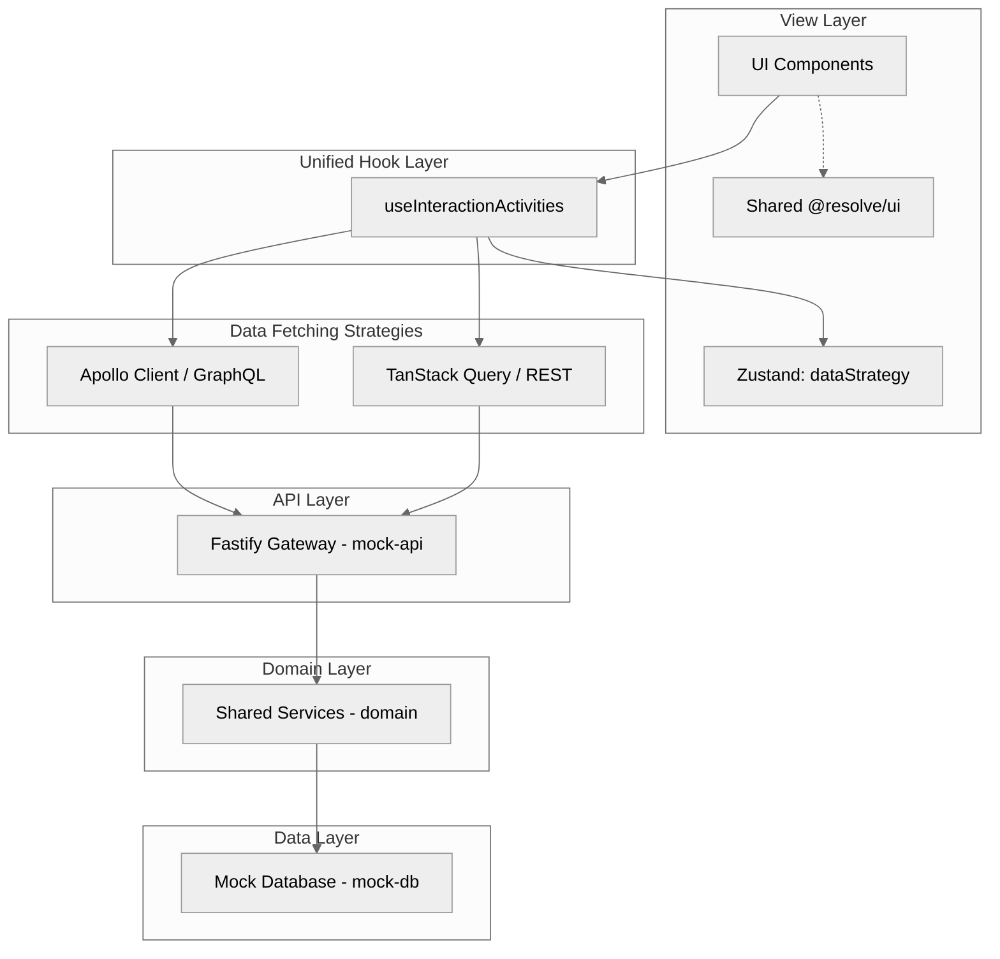
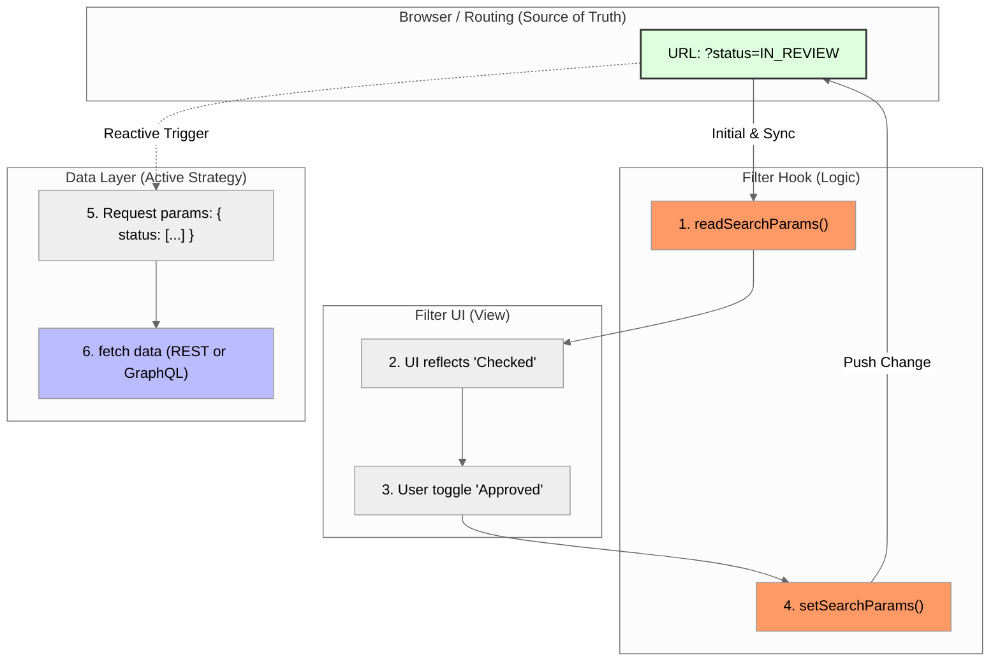
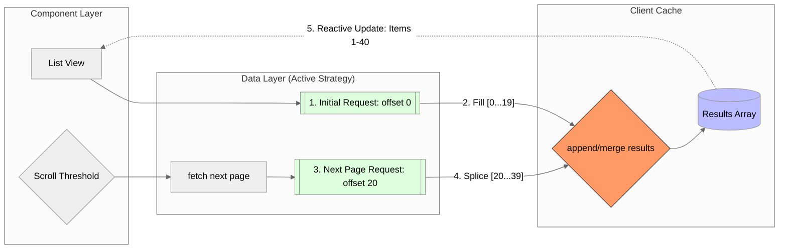

# Architecture Overview

This document describes the architectural decisions and tradeoffs behind this demo application. It assumes familiarity with React, TypeScript, GraphQL, REST, and modern SPA patterns.

---

# Resolve Application Goals

Resolve is the primary application used to demonstrate the frontend architecture of the ecosystem.

- URL-driven application state
- interchangeable GraphQL and REST data-fetching strategies
- normalized vs. document caching
- workspace-aware routing
- responsive application behavior
- accessible UI
- predictable mutation and activity workflows
- testable application behavior

## Non-Goals

- Building a production-grade backend  
- Pixel-perfect visual design  
- Exhaustive feature completeness  

---

# System Architecture

Resolve is the primary React application within the Resolve monorepo. It consumes the shared packages for domain contracts, UI components, and backend services while maintaining its own application-specific concerns such as routing, caching, state management, and responsive behavior.

At a high level, data flows through the application as follows:

```
┌───────────────────────────────┐
│        Resolve / React        │
│                               │
│  Components                   │
│  Hooks                        │
│  Routing / URL State          │
│  Zustand Application State    │
│  Apollo / React Query         │
└───────────────┬───────────────┘
                │
                │ REST / GraphQL
                ▼
┌───────────────────────────────┐
│       @resolve/mock-api       │
│                               │
│  Fastify                      │
│  REST / GraphQL               │
│  Request Context              │
└───────────────┬───────────────┘
                │
                ▼
┌───────────────────────────────┐
│        @resolve/domain        │
│                               │
│  Business Rules               │
│  Authorization                │
│  Workflows                    │
│  Record Resolution            │
└───────────────┬───────────────┘
                │
                ▼
┌───────────────────────────────┐
│        @resolve/mock-db       │
│                               │
│  Mock Data                    │
│  In-Memory State              │
│  StorageAdapter               │
│  Persistence                  │
└───────────────────────────────┘
```
Resolve does not implement these lower layers directly. They are shared across the monorepo so that the React application and other consumers can exercise the same domain behavior and data system.

Details of each shared layer are documented with the package that owns them.

-`@resolve/types`— domain models and shared TypeScript contracts

-`@resolve/ui` — shared presentation components and styling tokens

-`@resolve/domain` — business rules and domain services

-`@resolve/mock-db` — mock data, state, and persistence

-`@resolve/mock-api` — Fastify API and REST/GraphQL transport


## Domain Model

Resolve is built around a small set of related domain concepts:

- **Identity** — a person or company participating in the system
- **Interaction** — a workflow item such as a contract, review, or approval
- **InteractionActivity** — an event recorded during an interaction's lifecycle

These records are related through identities, parties, reviewers, actors, and workflow assignments.

The shared definitions for these models live in `@resolve/types`, while the domain package is responsible for resolving relationships and applying behavior to them.

# Application Architecture

This application is a client-side React SPA designed to be **backend-agnostic**.

At runtime, the app can switch between:
- GraphQL (Apollo Client + normalized cache)
- REST (TanStack Query + document cache)

This is controlled through a Developer HUD that allows the data strategy to be toggled at runtime.

The key idea is simple:

> The UI does not care where data comes from or how it is cached.

All data access flows through shared hooks and a unified service layer (see `@resolve/domain`), keeping components clean and predictable.

Core principles:

- Treat server state as external and authoritative  
- Keep data access behind stable abstractions (hooks)  
- Use the URL as the source of truth for view state  
- Avoid global state unless there is a clear need  
- Keep behavior consistent regardless of protocol  

## Data Layer & Protocol Strategy

The application uses a **protocol-agnostic data layer**.

It supports two interchangeable strategies:

- **Apollo Client (GraphQL)**  
  Uses a normalized cache with typePolicies for pagination, RBAC, and field behavior.

- **TanStack Query + Axios (REST)**  
  Uses a document-based cache with explicit query keys and manual invalidation.

### The Goal

Both strategies return the same *domain-shaped data* to the UI.

The difference is purely in:
- how data is fetched  
- how it is cached  

---

### The “Traffic Controller” Hook

Shared hooks (e.g. `useInteractionActivities`) act as the entry point for all data access.

A small Zustand store tracks the active strategy. The hook checks that value and routes the request to either:

- Apollo (GraphQL), or  
- React Query (REST)

From the component’s perspective, nothing changes.

It just asks for data and renders it.

---

### Why This Exists

This isn’t a typical production requirement, but it exists to demonstrate:

- how different data strategies behave  
- how to decouple UI from backend implementation  
- how to keep data flow predictable across approaches  

---

## Data Flow 

Resolve's application data flows through a consistent set of boundaries regardless of whether the application is using GraphQL or REST.


```mermaid
%%{init: {'theme': 'neutral', 'themeVariables': {'primaryColor': '#f96'}}}%%
graph TD

    subgraph UI_Layer [View Layer]
        COMP[UI Components]
        STRAT[Zustand: dataStrategy]
        UI[Shared @resolve/ui]
    end

    subgraph Hooks [Unified Hook Layer]
        UH[useInteractionActivities]
    end

    subgraph Providers [Data Fetching Strategies]
        APO[Apollo Client / GraphQL]
        TAN[TanStack Query / REST]
    end

    subgraph API [API Layer]
        API_APP[Fastify Gateway - mock-api]
    end

    subgraph Domain [Domain Layer]
        SVC[Shared Services - domain]
    end

    subgraph Data [Data Layer]
        DB[Mock Database - mock-db]
    end

    COMP --> UH
    COMP -.-> UI

    UH --> STRAT
    UH --> APO
    UH --> TAN

    APO --> API_APP
    TAN --> API_APP

    API_APP --> SVC
    SVC --> DB
```

The application supports two client-side data-fetching strategies: Apollo Client for GraphQL and TanStack Query for REST. Both follow the same underlying application flow shown above, while maintaining their own caching behavior.


## Client Caching Strategy

This application intentionally supports **two different caching models**:

| Aspect | Apollo Client | TanStack Query |
|------|--------|------------|
| Cache Type | Normalized | Document |
| Granularity | Entity-level | Request-level |
| Invalidation | Schema-aware | Query-key based |

Rather than forcing a single approach, the app supports both.


### Important Distinction

- Apollo acts like a **graph of entities**
- React Query acts like a **set of cached responses**

The architecture does not try to unify these internally.

Instead, it ensures both produce the same **final data shape for the UI**.

---

### Apollo-specific enhancements (GraphQL mode only)

> **Architectural Note: Reactive RBAC**
> While `permittedActions` are initially calculated in the resolver found in `@resolve/domain`, they are also defined in an Apollo `typePolicy` read function. This allows the UI to reactively re-calculate permissions when the `activeRoleVar` changes (e.g., via the Developer HUD) without requiring a refetch or a manual cache update.

Custom `typePolicies` are used to:

- Define pagination merge behavior for activity feeds  
- Normalize optional fields (e.g., `company`, `avatarUrl`) to `null` for shape stability  
- Return mutation-specific fields (e.g., `notifications`) without permanently merging them into stored entity state  
- Re-calculate permittedActions reactively whenever the global simulated role changes

Pagination for activity feeds relies on a cache `merge` policy, allowing incremental loading without local state concatenation.

These decisions ensure consistent object shapes and predictable list behavior across views.

---

## State Management Strategy

State is intentionally layered:

- **Server state:**  
  Apollo cache (GraphQL) or React Query cache (REST)

- **Navigation and cross-page state:**  
  URL parameters  

- **Protocol selection:**  
  Zustand (Dev HUD toggle)

- **Local UI state:**  
  Component state (menus, modals, etc.)

--- 

## Routing & URL-Driven State

React Router v6 is used with nested routes under a shared layout.

The URL acts as the source of truth for navigation and view state. This includes:

- Workspace context  
- Active route and route parameters  
- Selected tabs within detail views  
- Pagination state  
- Filter state  

This makes navigation predictable, shareable, and reload-safe. Refreshing the page or copying the URL preserves the current view.

Component state is reserved for UI behavior (e.g., open/closed popovers, drawers, or temporary input values), not for core application state.

### Workspace Scoping

All primary routes are scoped under a workspace prefix:

```
/w/:workspaceId/...
```

The workspace ID is treated as part of the application state and is included in all relevant queries. This models a basic multi-tenant structure and ensures data is properly isolated by workspace.

Switching workspaces updates the URL and re-scopes the entire application without requiring global state resets.

### Interaction Detail Routing

Interaction detail pages use URL-driven tabs:

```
/interactions/:interactionId/:tabId
```

- Invalid or missing tab IDs redirect to a valid default  
- Tab selection is derived from the route, not internal component state  

This allows deep linking while preserving browser navigation behavior.

---

# Data Presentation & Interaction

## Filtering System


```mermaid
%%{init: {'theme': 'neutral', 'themeVariables': { 'primaryColor': '#f96'}}}%%
graph TD
    subgraph Browser ["Browser / Routing (Source of Truth)"]
        URL["URL: ?status=IN_REVIEW"]
    end

    subgraph Hook ["Filter Hook (Logic)"]
        Read["1. readSearchParams()"]
        Write["4. setSearchParams()"]
    end

    subgraph UI ["Filter UI (View)"]
        Check["2. UI reflects 'Checked'"]
        Click["3. User toggle 'Approved'"]
        Check --> Click
    end

    subgraph Data ["Data Layer (Active Strategy)"]
        Vars["5. Request params: { status: [...] }"]
        Query["6. fetch data (REST or GraphQL)"]
    end

    %% The Circular Flow
    URL -->|Initial & Sync| Read
    Read --> Check
    Click --> Write
    Write -->|Push Change| URL
    
    %% The Data Side-Effect
    URL -.->|Reactive Trigger| Vars
    Vars --> Query

    style URL fill:#dfd,stroke:#333,stroke-width:2px
    style Read fill:#f96
    style Write fill:#f96
    style Query fill:#bbf
```
> *The filtering system implements a stateless UI pattern: components do not maintain local filter state, but instead 'request' URL transitions. This ensures that browser navigation (Back/Forward) and deep-linking work out-of-the-box without manual state synchronization.*

Filtering is designed to be:

- URL-driven  
- Predictable  
- Easy to extend  
- Accessible  

Filtering is separated into three layers:

1. **Reference data** (available filter options)  
2. **Filter state** (URL parameters)  
3. **Filter UI** (input components)  

Filter hooks:

- Treat the URL as the source of truth  
- Read values from search parameters
- Update search parameters via setSearchParams
- Expose domain values (IDs, enums), not labels  
- Do not fetch data  
- Do not serialize complex objects  

Multi-select filters use repeated query parameters:

```
?status=IN_REVIEW&status=APPROVED
?partyId=123&partyId=456
```

This keeps the URL readable and maps cleanly to request parameters, whether that’s query variables (GraphQL) or query params (REST).

Filter components receive options via props and read/write state via hooks. They do not derive options from results or own data-fetching logic.

The filtering system is intentionally decoupled from the data-fetching layer. The URL drives the request shape, and each data strategy adapts that into its own format.

---

## Pagination

Two pagination strategies are used intentionally.

### Table-Style Pagination (Interactions List)

Pagination state is URL-driven:

```
?page=1&pageSize=25
```

- Persisted across reloads  
- Shareable via URL  
- Resets automatically when filters change  

A custom pagination component is used instead of a UI library version to keep behavior explicit and framework-agnostic.

### Infinite Scroll (Dashboard & Global Search)

Infinite scroll is used where pagination state does not need to persist in the URL.

This pattern relies on a cache-driven approach, where new pages are appended to existing results. The exact mechanism differs slightly between Apollo and React Query, but the behavior is consistent from the UI’s perspective.


```mermaid
%%{init: {'theme': 'neutral', 'themeVariables': { 'primaryColor': '#f96'}}}%%
graph LR
    subgraph View ["Component Layer"]
        UI[List View]
        Trigger{Scroll Threshold}
    end

    subgraph DataLayer ["Data Layer (Active Strategy)"]
        Fetch[fetch next page]
        Req1[[1. Initial Request: offset 0]]
        Req2[[3. Next Page Request: offset 20]]
        
        UI --> Req1
        Trigger --> Fetch
        Fetch --> Req2
    end

    subgraph Cache ["Client Cache"]
        Merge{append/merge results}
        Data[( Results Array )]

        Req1 -->|"2. Fill [0...19]"| Merge
        Req2 -->|"4. Splice [20...39]"| Merge
        Merge --> Data
    end

    Data -.->|"5. Reactive Update: Items 1-40"| UI

    style Merge fill:#f96,stroke:#333
    style Data fill:#bbf
    style Req1 fill:#dfd
    style Req2 fill:#dfd
```
> *This indexed-merge strategy ensures that the UI is always a pure, reactive 'window' into the cache, separating the scroll-event logic from the data-rendering logic.*

#### Core Implementation

- **Offset + Limit Pagination**  
  Both strategies use standard offset/limit (or equivalent cursor-based patterns) to request additional pages.

- **Cache-Level Merging**  
  New results are merged into existing cached data rather than stored in local component state.

  - In Apollo, this is handled via `typePolicies.merge`  
  - In React Query, this is handled via `useInfiniteQuery` and page accumulation  

- **Reactive Hooks**  
  Components (e.g., `useSearchResults`) react to cache updates. As new data is fetched, the UI updates automatically without manual state management.

- **Scroll Trigger**  
  A scroll listener triggers the next page request when the user reaches a defined threshold.

This pattern allows the list to grow "in place," preserving scroll position and avoiding the need for manual state concatenation in components.

---

## Activity System

The activity system models lifecycle events tied to interactions.

Activities are generated in a lifecycle-based sequence rather than randomly. When an interaction’s status is updated, a corresponding activity is created that reflects that change.

This ensures:

- Activity timelines appear in logical order  
- Status badges align with recorded activity  
- Workflow transitions feel intentional  

Each activity type uses a shared `ActivityCard` wrapper with type-specific content components.

---

# Application Shell

## Application Layout

The application uses a shared layout with:

- A header  
- A sidebar  
- A main content area  

The header contains global controls (workspace switcher, search, user menu).  
The sidebar contains primary navigation.

### Responsive Behavior

Responsive design is treated as a core requirement.

Standard layout changes are handled through CSS breakpoints. In addition, some behaviors are driven by shared breakpoint logic where appropriate.

Examples include:

- The sidebar collapsing behind a hamburger menu on smaller screens  
- Filters moving into a bottom sheet on mobile  
- Global search switching between a dropdown (desktop) and full-screen takeover (mobile)  

This keeps layout changes intentional and predictable rather than scattered across isolated media queries.

---

## Styling Approach

Styling is handled using SCSS Modules and a set of global design tokens, imported from `@resolve/ui`.

The token system centralizes:

- Spacing scale  
- Border radius values  
- Color palette  
- Status colors  
- Elevation and borders  

This avoids repeating hard-coded values and keeps visual decisions consistent across components.

CSS Modules provide style isolation while allowing predictable overrides. Class names use dash-case in SCSS and are accessed as camelCase in JSX for clarity and consistency.

Material UI is used selectively for complex controls (e.g., Global Search). Core layout and structural components are custom-built.

The goal is consistency and clarity rather than heavy theming.

---

## Accessibility

Accessibility is treated as a first-class concern.

- Semantic HTML elements are used where appropriate  
- Interactive elements are keyboard-navigable  
- Focus states are explicit  
- ARIA roles are added when semantic HTML alone is insufficient  
- Filters and pagination are accessible via keyboard  

Accessibility is addressed intentionally rather than retrofitted later.


# Testing Strategy

We focus on testing what the user actually sees and does. Instead of faking internal functions, we utilize the full stack to validate workflows across routing, workspace scoping, URL state, dual-protocol behavior, and status transitions.

The project uses Vitest and React Testing Library. To keep things realistic, our renderWithRouter helper mirrors the real app setup—including Apollo, TanStack Query, routing, and our modal providers.

Coverage prioritizes:

- URL-driven filtering and pagination
- Workspace scoping
- Status transitions creating activities
- Dashboard updates after mutations
- Keyboard accessibility for buttons and modals

## Leveraging "Full-Stack" in Testing:

-  **Incorporating the Real Backend:** For both our REST and GraphQL tests, we use the same Fastify backend (`@resolve/mock-api`) the main app uses. This means the tests fire off the same REST and GraphQL requests used by the app, hitting our service logic (`@resolve/domain`) just like it would in the browser.
- **Automatic Validation:** Because the tests hit the same handlers and logic as the browser, they act as a "smoke test." If you change a business rule in the code, the tests and the demo both update immediately.
-  **Defensive Design:** Since tests run at high speed, the service layer is built to handle rapid-fire actions (like accidental double-clicks). This allows us to protect the backend (`@resolve/mock-api`) from getting hit with the same request twice.
-  **Cache Synchronization:** We make sure the Apollo and TanStack caches are "seeded" during tests. This ensures that things like pagination and navigation stay predictable and don't show "stale" data or weird flashes during assertions.
-  **Clean Slate:** To keep tests from leaking into each other, the in-memory mock data is reset before every single test run.

---


# Tradeoffs & Intentional Omissions

Some features are intentionally simplified to keep the focus on architectural clarity:

- Visual design is restrained: The UI uses a clean, functional aesthetic rather than high-fidelity custom brand styling.
- No real-time collaboration: While the app models multiple users and identities, it is a single-user simulation.
- Simplified Identity Management: Authentication is bypassed to allow immediate access to the demo environment.

These tradeoffs ensure the codebase remains readable and focused on the data-flow patterns.

---

# Summary

The Resolve application prioritizes realism, clarity, and flexibility.

It demonstrates:

- **Protocol-Agnostic Data Flow**  
  The app can run entirely on GraphQL (Apollo) or REST (React Query), with a runtime switch between the two.

- **Decoupled UI Layer**  
  Components consume stable data contracts and are not tied to any backend implementation.

- **Dual Caching Strategies**  
  Supports both normalized and document caching, with shared persistence via localStorage.

- **Layered State Management**
  State is layered with Server State (caching strategies), URL-Driven State (filters, pagination, workspace), minimal global state (Zustand store), and local UI state (menus, modals, etc.).

- **Responsive and Accessible Behavior**  
  The UI is intentional in its implementation of responsivity and accessibility, treating them as first-class concerns.

- **Testable Application Behavior**
  Because the tests hit the same handlers and logic as the browser, they act as a "smoke test." If you change a business rule in the code, the tests and the app both update immediately.

---


