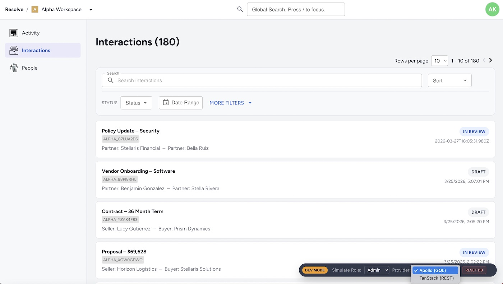

# Resolve — Workflow Architecture Demo

A React + TypeScript application demonstrating backend-agnostic data architecture.

The app can switch at runtime between:
- GraphQL (Apollo Client)
- REST (TanStack Query)

From the UI’s perspective, there is effectively a single data layer—the underlying protocol is an implementation detail.

It models workspace-scoped workflows, activity feeds, and URL-driven state to simulate real-world application behavior.



*Runtime data strategy switching via Developer HUD (bottom-right) — UI remains consistent while network requests change.*

### What you're seeing

- Bottom-right: Dev HUD for switching data strategies  
- Same UI, different network behavior (REST ↔ GraphQL)  
- Workflow-driven data with persistent state  

## Live Demo

🔗 https://resolve-demo.vercel.app/

No authentication required.

The app uses a persistent mock backend (via localStorage), so workflow changes and state updates are preserved across sessions.

## Developer Simulation Tools
The application includes a Developer Overlay (bottom-right) to make the architecture easy to explore. This allows you to:

*  Toggle RBAC Roles: Instantly switch between Admin, Editor, and Viewer to see real-time, server-driven UI gating.
*  Reset Database: Wipe the persistent localStorage and return the environment to its default mock records.
*  Monitor Sync: Observe the background persistence heartbeat when mutations occur.
*  Toggle Data Strategy: Switch between GraphQL and REST mid-session. The network tab updates while the UI remains consistent.

## Why This Project Exists

In previous roles, I worked on enterprise-style applications involving:

*   Workspace scoping
*   Workflow lifecycles
*   Activity feeds
*   URL-driven filtering and pagination
*   Mutation-driven state updates
    

Those systems were proprietary and are no longer publicly accessible. Rather than describe that experience abstractly, this repository reconstructs similar architectural patterns in a standalone, inspectable demo.

The goal is not to build a startup product mockup. The goal is to demonstrate architectural thinking in a controlled, readable codebase. This repository is intentionally architecture-focused rather than feature-heavy.

## TL;DR (For Reviewers)

This is a multi-tenant React SPA that demonstrates backend-agnostic data architecture.

Using the Developer HUD, the app can switch between:
- GraphQL (Apollo Client)
- REST (TanStack Query)

Both strategies share the same business logic, mock database, and persistence layer.

Result: identical UI behavior across fundamentally different data-fetching approaches.

## What It Demonstrates

### Architecture
- Backend-agnostic data layer (GraphQL + REST)
- Unified service layer for business logic
- API vs Domain type separation

### Data & State
- URL-driven filtering and pagination
- Deterministic workflow state transitions
- Activity generation tied to mutations
- Cache-driven UI updates

### UX & Behavior
- Multi-tenant workspace routing
- Responsive layout
- Keyboard-accessible UI patterns

### Developer Experience
- Runtime data strategy switching
- Persistent mock data via localStorage
- Integration-style testing with MSW
    

## Core Domain Model

The application models a small but connected domain:

*   **Workspace**
    A tenant boundary that scopes all primary routes and data.
    
*   **Interaction**
    A workflow item that moves through defined lifecycle states.
    
*   **Identity**
    An individual or company participating in interactions.
    
*   **InteractionActivity**
    An event generated when interaction state changes occur.
    

Interactions reference identities through structured party roles and reviewer relationships. Activities reference identities as actors and decision-makers, forming a lifecycle history across entities.

The domain is intentionally simple, but the relationships are modeled explicitly.

## Architectural Highlights

This is a client-side React SPA with a unified service layer and network-level mocking via MSW.

Key themes:

*   The URL drives view state (filters, pagination, tab selection)
*   Data strategies are interchangeable (Apollo or React Query)
*   Workflow transitions generate activity records
*   Cache behavior is explicitly controlled for pagination and merging
*   Domain logic lives in the shared service layer
*   Global state is avoided unless clearly necessary
*   Smart Data Loading: When the app starts, it checks for saved data first; if nothing is found, it generates a fresh set of mock records.
*   Reactive Permissions: I’ve configured the Apollo cache to re-calculate what you’re allowed to do the moment you switch roles in the Developer Overlay.
*   Efficient background saving: Instead of saving to the browser on every single keystroke, the app batches those updates to keep performance high.
    

A detailed breakdown of architectural decisions is available here:

→ **[ARCHITECTURE.md](./ARCHITECTURE.md)**

## Testing Strategy

Testing focuses on full-stack simulation rather than implementation details.

Unlike traditional mocks that stub out internal functions, this project uses MSW (Mock Service Worker) to intercept network traffic at the request level. This ensures that Vitest exercises the exact same Axios/Apollo calls, MSW Handlers, and Service Logic used in the live browser demo, achieving full environment parity.

Coverage includes:

*   URL-driven filtering and pagination
*   Workspace scoping
*   Status transitions generating activity records
*   Dashboard updates after mutations
*   Keyboard accessibility behavior
    

The in-memory execution layer allows realistic integration-style tests without stubbing network calls.

## Tech Stack

*   React 18 & TypeScript
*   React Router
*   Apollo Client (GraphQL Strategy)
*   TanStack Query & Axios (REST Strategy)
*   MSW (Mock Service Worker) (Network Interception)
*   Zustand (Global Strategy State)
*   Vitest + React Testing Library
*   SCSS Modules
*   Vite
    

## Running Locally

Install dependencies:

```bash
npm install
```
Start the development server:

```bash
npm run dev
```
Run tests:

```bash
npm run test  
```
Backend-Agnostic Testing

Since the application supports dual data strategies, the test suite is designed to be strategy-aware. You can run the full suite against either protocol to verify architectural parity:

```bash
# Run all tests using the GraphQL (Apollo) strategy
npm run test:apollo

# Run all tests using the REST (TanStack Query) strategy
npm run test:tanstack

# Run both in sequence to ensure 100% logic parity
npm run test:all
```

## Future Roadmap

This project is an evolving architectural playground. Current planned evolutions include:

*   Skeleton Loaders: Implement CSS-module based skeleton loaders for Identity and Interaction lists.
*   Network Simulation: Adding latency and error-rate toggles to the Dev Overlay to test UI resilience under degraded conditions.

## Notes

This project prioritizes architectural clarity over visual polish or backend infrastructure.

The application uses MSW (Mock Service Worker) to simulate a backend at the network level. All requests—REST and GraphQL—are routed through a shared service layer that handles business logic, filtering, and mutations.

The result is a self-contained system that behaves like a real backend-driven application while remaining easy to inspect and reason about.