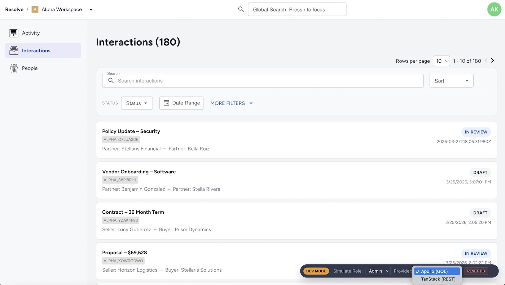

# Resolve — Workflow Architecture Demo

Resolve is a React + TypeScript application built as a demonstration of
enterprise-style frontend architecture.

The application models workspace-scoped workflows, identities, and activity
history while demonstrating URL-driven state, interchangeable data-fetching
strategies, shared domain logic, and application-level state management.

Resolve is one application within a larger monorepo architecture. Shared
domain contracts, UI components, domain services, mock persistence, and the
Fastify API are maintained in separate packages and applications.



*Runtime data strategy switching via Developer HUD (bottom-right) — UI remains consistent while network requests change.*

### What you're seeing

- Bottom-right: Dev HUD for switching data strategies  
- Same UI, different network behavior (REST ↔ GraphQL)  
- Workflow-driven data with persistent state  


## Live Demo

🔗 https://resolve-demo.vercel.app/

No authentication required.

The Developer HUD allows you to:

- switch between GraphQL and REST
- change the active role
- reset the demo data
- observe application behavior under different configurations


## What to Explore

Resolve is designed to make its architectural decisions visible through the UI. Some areas worth exploring:

- **Developer HUD** — switch between REST and GraphQL and change the active role.
- **Interactions** — explore URL-driven filtering, sorting, pagination, and workspace scoping.
- **Interaction detail** — transition an interaction and observe the resulting state and activity changes.
- **Activity feeds** — see how mutation-driven activity records are reflected in the UI.
- **People page** - see how mutation-driven activity is reflected in user stats on their identity card
- **Profile** - explore interactions and activity records related to an individual user
- **Browser Network tab** — compare the requests generated by the REST and GraphQL strategies.


## What It Demonstrates

- **URL-driven state** — workspace, filtering, pagination, and view state are
  represented through application routes and query parameters.

- **Interchangeable data strategies** — the application can use either Apollo
  Client/GraphQL or TanStack Query/REST without changing the UI.

- **Shared domain behavior** — REST and GraphQL ultimately use the same domain
  services and workflow rules.

- **Workflow-driven mutations** — interaction transitions can update related
  state and generate activity records.

- **Shared UI architecture** — reusable UI components live in `@resolve/ui`
  while application-specific behavior remains in Resolve adapters.

- **Integration-style testing** — tests exercise the application through its
  API boundaries rather than replacing the underlying services.


## Architecture

Resolve is part of a larger monorepo architecture. The application itself
owns the React UI, application state, routing, caching strategy, and
presentation behavior, while shared capabilities are maintained in separate
packages.

See [ARCHITECTURE.md](./ARCHITECTURE.md) for the application-level
architecture and design decisions.

The supporting packages document their own responsibilities and boundaries:

- `@resolve/types` — shared domain contracts
- `@resolve/ui` — shared UI components and design tokens
- `@resolve/domain` — shared domain services and business rules
- `@resolve/mock-db` — mock data and persistence
- `@resolve/mock-api` — Fastify API and request orchestration


## Tech Stack

*   React 19 & TypeScript
*   React Router
*   Apollo Client (GraphQL Strategy)
*   TanStack Query & Axios (REST Strategy)
*   Zustand (Global Strategy State)
*   Vitest + React Testing Library
*   SCSS Modules
*   Vite

    

## Running Locally

For all commands listed below, run them from the base PNPM monorepo directory.

Install dependencies:

```bash
pnpm install
```
Start the development server:

```bash
pnpm --filter resolve-demo dev
```
Run tests:

```bash
pnpm --filter resolve-demo test
```
### Backend-Agnostic Testing

Since the application supports dual data strategies, the test suite is designed to be strategy-aware. You can run the full suite against either protocol to verify architectural parity:

```bash
# Run all tests using the GraphQL (Apollo) strategy
pnpm --filter resolve-demo test:apollo

# Run all tests using the REST (TanStack Query) strategy
pnpm --filter resolve-demo test:tanstack

# Run both in sequence to ensure 100% logic parity
pnpm --filter resolve-demo test:all
```
